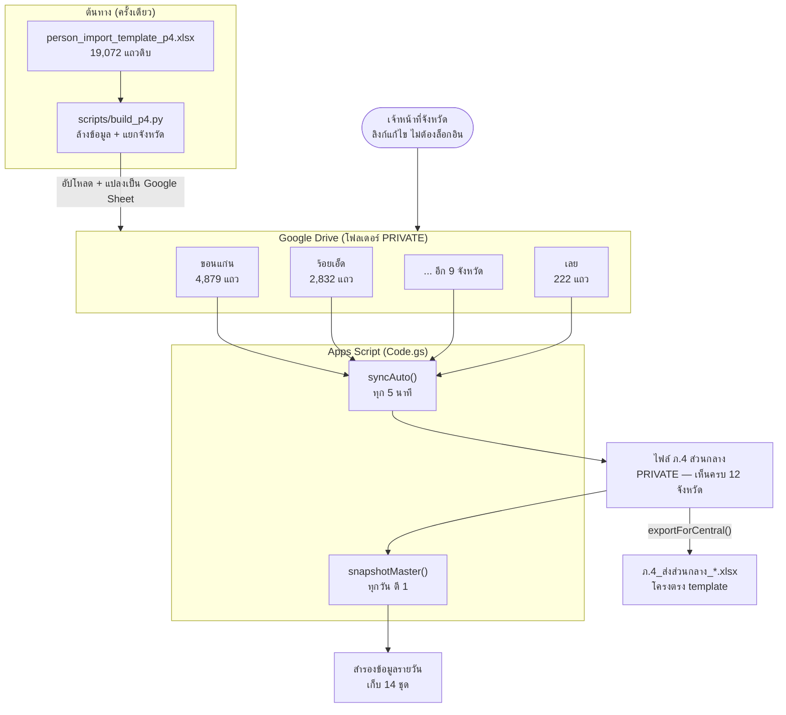
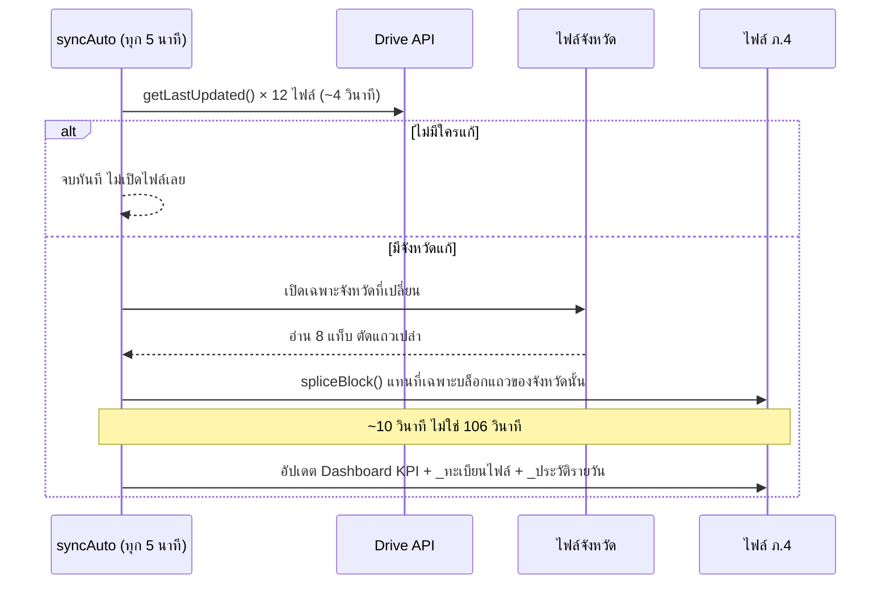

# ระบบรวบรวมข้อมูลบุคคล ภ.4 — เอกสารระบบฉบับสมบูรณ์

> ไฟล์เดียวจบ อ่านแล้วเข้าใจระบบทั้งหมด ใช้งานต่อ แก้ไข และขยายได้
> อัปเดตล่าสุด: 2026-07-09

---

## 1. ระบบนี้คืออะไร

ตำรวจภูธรภาค 4 (ภ.4) ต้องรวบรวมข้อมูลบุคคลเฝ้าระวัง 8 ประเภท จาก **12 จังหวัด**
แล้วส่งต่อส่วนกลางในรูปแบบ Excel template ที่ส่วนกลางกำหนดมา

ระบบนี้แก้ 3 ปัญหาพร้อมกัน:

| ปัญหา | วิธีแก้ |
|---|---|
| แต่ละจังหวัดต้องเห็นเฉพาะข้อมูลตัวเอง | แยกเป็น Google Sheet คนละไฟล์ 12 ไฟล์ |
| ภ.4 ต้องเห็นภาพรวมแบบเรียลไทม์ | Apps Script ดึงรวมทุก 5 นาที + ปุ่มดึงเดี๋ยวนี้ |
| ต้องส่งส่วนกลางด้วย template เดิมเป๊ะ | ไฟล์ ภ.4 ใช้คอลัมน์เดียวกับ template 100% ไม่เพิ่มแม้แต่คอลัมน์เดียว |

**ข้อมูลจริงในระบบ: 17,553 แถว**

---

## 2. สถาปัตยกรรม



### ทำไมต้องแยกเป็นคนละไฟล์

Protected range ใน Google Sheets ป้องกันแค่การ **แก้** ไม่ได้ป้องกันการ **อ่าน**
คนที่เปิดไฟล์ได้ยังดึงข้อมูลทุกแท็บผ่าน API ได้อยู่ดี
การให้แต่ละจังหวัดเห็นเฉพาะข้อมูลตัวเอง จึงต้องแยกเป็นคนละ Spreadsheet เท่านั้น

---

## 3. ข้อมูล 8 ประเภท

ตรงกับ 8 ค่าในชีต `Lists` คอลัมน์ `ประเภทข้อมูล` แบบ 1:1

| # | ชีต | ประเภทข้อมูล | คอลัมน์ | ที่มาของโครง | แถวจริง |
|---|---|---|---:|---|---:|
| 1 | `กลุ่ม5สี11กลุ่ม` | กลุ่ม 5 สี 11 กลุ่ม | 29 | ต้นฉบับ | 663 |
| 2 | `ถวายฎีกา` | บุคคลถวายฎีกา | 30 | ต้นฉบับ | 0 |
| 3 | `ม112_มั่นคง` | บุคคล ม.112/คดีความมั่นคง | 28 | ต้นฉบับ | 12 |
| 4 | `จิตเวชรักษา` | บุคคลจิตเวชมีประวัติการรักษา | 30 | ต้นฉบับ | 16,878 |
| 5 | `เร่ร้อน` | บุคคลเร่ร้อน | 28 | ต้นฉบับ | 0 |
| 6 | `ร้องทุกข์_ดำรงธรรม` | ข้อมูลยื่นเรื่องราวร้องทุกข์ผ่านศูนย์ดำรงธรรม | 30 | ยืมจาก ถวายฎีกา | 0 |
| 7 | `ร้องทุกข์_หน่วยงานอื่น` | ข้อมูลยื่นเรื่องราวร้องทุกข์ หน่วยงานอื่นๆ | 30 | ยืมจาก ถวายฎีกา | 0 |
| 8 | `เฝ้าระวัง_ทะเลาะวิวาท` | กลุ่มบุคคลเฝ้าระวัง (ทะเลาะวิวาท) | 29 | ยืมจาก กลุ่ม5สี11กลุ่ม | 0 |

3 ชีตสุดท้ายเป็นชีตใหม่ — **ไม่คิดคอลัมน์ใหม่** แต่ยืมโครงคอลัมน์จากชีตที่มีอยู่ใน template

### โครงคอลัมน์ร่วม (คอลัมน์ A–U เหมือนกันทุกชีต)

```
A ประเภทข้อมูล*        H คำนำหน้า            O วันเกิด
B จังหวัด*             I ชื่อ* / ชื่อ         P อายุ
C อำเภอ/เขต*           J นามสกุล             Q สัญชาติ
D ตำบล/แขวง            K ชื่อเล่น/ชื่ออื่น †  R โทรศัพท์
E หน่วยงานเจ้าของข้อมูล* L เลขบัตรประชาชน †   S ที่อยู่ปัจจุบัน
F เลขที่อ้างอิงต้นทาง   M เลขเอกสารอื่น       T ที่อยู่ตามทะเบียนบ้าน
G วันที่บันทึก*         N เพศ                U อาชีพ/สถานะการทำงาน
```

† **`กลุ่ม5สี11กลุ่ม` ไม่มีคอลัมน์ `ชื่อเล่น/ชื่ออื่น`** ทุกอย่างหลังจากนั้นจึงเลื่อนขึ้น 1 ช่อง
`เลขบัตรประชาชน` อยู่คอลัมน์ **K** ในชีตนั้น แต่อยู่คอลัมน์ **L** ในชีตอื่น
โค้ดทุกที่จึงหาตำแหน่งคอลัมน์จาก **ชื่อหัวตารางจริง** ไม่ hardcode ตัวอักษร

`จิตเวชรักษา` ใช้หัวคอลัมน์ `ชื่อ` (ไม่มี `*`) ต่างจากชีตอื่นที่ใช้ `ชื่อ*` — คงไว้ตามต้นฉบับ

### ฟิลด์เฉพาะประเภท (อยู่หลังคอลัมน์ U)

| ชีต | คอลัมน์เพิ่ม |
|---|---|
| กลุ่ม5สี11กลุ่ม / เฝ้าระวัง_ทะเลาะวิวาท | ชื่อกลุ่ม/เครือข่าย |
| ถวายฎีกา / ร้องทุกข์ทั้งสอง | เลขคำร้อง/เลขฎีกา, ช่องทางรับเรื่อง |
| จิตเวชรักษา | สถานพยาบาล/หน่วยรักษา, ประวัติการรักษาโดยย่อ |

ทุกชีตปิดท้ายด้วย: จุดพบเห็น/พื้นที่พักอาศัย, รายละเอียดพฤติการณ์/บริบท, ระดับความเร่งด่วน,
ผู้รับผิดชอบติดตาม, วันที่ติดตามถัดไป, แหล่งที่มา/หลักฐาน, หมายเหตุ

---

## 4. ข้อมูลตั้งต้นรายจังหวัด

| จังหวัด | แถว | | จังหวัด | แถว |
|---|---:|:-:|---|---:|
| ขอนแก่น | 4,879 | | มุกดาหาร | 944 |
| ร้อยเอ็ด | 2,832 | | นครพนม | 735 |
| กาฬสินธุ์ | 1,827 | | มหาสารคาม | 482 |
| สกลนคร | 1,736 | | หนองคาย | 308 |
| หนองบัวลำภู | 1,339 | | เลย | 222 |
| บึงกาฬ | 1,242 | | | |
| อุดรธานี | 1,007 | | **รวม** | **17,553** |

---

## 5. โครงสร้างไฟล์

### ไฟล์จังหวัด (12 ไฟล์ เหมือนกันทุกไฟล์)

```
README            คำอธิบาย + คำแนะนำเฉพาะฉบับแยกจังหวัด (ล็อกทั้งชีต)
กลุ่ม5สี11กลุ่ม   ┐
ถวายฎีกา          │
ม112_มั่นคง       │  ข้อมูลเดิมของจังหวัดนั้น + แถวสำรอง 500 แถว/ชีต
จิตเวชรักษา       │  ที่ pre-fill ประเภทข้อมูล* + จังหวัด* ไว้แล้ว
เร่ร้อน           │
ร้องทุกข์_ดำรงธรรม│
ร้องทุกข์_หน่วยงานอื่น
เฝ้าระวัง_ทะเลาะวิวาท ┘
Lists             แหล่ง dropdown (ล็อกทั้งชีต)
```

### ไฟล์ ภ.4 ส่วนกลาง

```
README            คัดลอกจาก template (ตัดข้อความ "ฉบับแยกจังหวัด" ออก)
ภาพรวม            ★ KPI + 2 ตาราง + 5 กราฟ + ปุ่มดึงข้อมูล
8 ชีตข้อมูล       ข้อมูลทั้ง 12 จังหวัดต่อกัน เรียงตามลำดับจังหวัดใน CONFIG
Lists             แหล่ง dropdown
_ทะเบียนไฟล์      ลิงก์ไฟล์จังหวัด + จำนวนแถว + เวลาแก้ไข/ซิงค์ล่าสุด
_ข้อมูลกราฟ       (ซ่อน) บล็อก 2 คอลัมน์ที่กราฟวงกลม/รายคอลัมน์ต้องใช้
_ประวัติรายวัน    (ซ่อน) จำนวนแถวรายวัน ป้อนกราฟเส้น
```

แท็บที่ไม่ใช่ template อยู่ใน `HELPER_TABS` — `exportForCentral()` ลบทิ้งก่อนส่งส่วนกลาง

### แท็บ ภาพรวม

```
แถว 1-2    ชื่อเรื่อง | อัปเดตล่าสุด | [ ↻ ดึงข้อมูลล่าสุด ] | สถานะการดึงข้อมูล
แถว 4-5    รวมทุกประเภท | จังหวัดที่มีข้อมูล | ความครบถ้วน | ช่องบังคับที่ยังว่าง
แถว 7-21   ตารางจำนวนข้อมูล   จังหวัด × 8 ประเภท + รวม
แถว 23-37  ตารางความครบถ้วน   จังหวัด × 6 คอลัมน์ + เฉลี่ย + แถวรวมถ่วงน้ำหนัก
แถว 40+    กราฟ 5 ตัว
```

| กราฟ | บอกอะไร |
|---|---|
| คอลัมน์ซ้อน | จำนวนข้อมูลรายจังหวัด แยกตามประเภท |
| วงกลม | สัดส่วนตามประเภทข้อมูล |
| แท่งแนวนอน | **% ความครบถ้วนของช่องบังคับ รายจังหวัด** |
| คอลัมน์ | **% ความครบถ้วนของช่องบังคับ รายคอลัมน์** |
| เส้น | จำนวนข้อมูลรวม รายวัน |

ตัวเลขทั้งหมดคำนวณด้วยสูตร `COUNTIF` / `COUNTIFS` ในชีต ไม่ใช่สคริปต์ → ไม่กินโควตา trigger
แถวรวมของตารางความครบถ้วนใช้ `SUMPRODUCT` **ถ่วงน้ำหนักด้วยจำนวนแถว** ไม่ใช่ค่าเฉลี่ยธรรมดา
(เลย 222 แถว ไม่ควรมีน้ำหนักเท่าขอนแก่น 4,879 แถว)

---

## 6. การรวมข้อมูลทำงานอย่างไร



### หลักการ 7 ข้อ

1. **เช็คก่อนเปิด** — อ่าน `lastUpdated` จาก Drive ก่อน ถ้าไม่มีใครแก้ก็จบ ไม่เปิดไฟล์เลย
2. **แก้เฉพาะบล็อก** — แถวในชีตส่วนกลางเรียงตามลำดับจังหวัดใน `CONFIG.PROVINCES` เสมอ
   Script Property `TAB_COUNTS` เก็บว่าแต่ละจังหวัดกินกี่แถว → คำนวณ offset แล้ว splice เฉพาะช่วงนั้น
3. **ถ้าตัวนับเพี้ยน ให้ล้ม** — `spliceBlock_()` โยน error แล้ว **fallback ไป rebuild เต็มอัตโนมัติ**
   ไม่ยอมเขียนผิดที่
4. **จับคู่คอลัมน์ด้วยชื่อหัวตาราง** ไม่ใช่ตำแหน่ง — จังหวัดเผลอสลับคอลัมน์ก็ยังรวมถูกช่อง
5. **`จังหวัด*` และ `ประเภทข้อมูล*` เขียนทับ** ด้วยค่าจากไฟล์ต้นทางและชื่อชีต
   ไม่ใช่จากที่เจ้าหน้าที่พิมพ์ — พิมพ์ผิดก็ไม่ไปโผล่ผิดจังหวัด
6. **แถวสำรองไม่ถูกดึงมา** — กฎ "แถวมีข้อมูล" ไม่นับ `ประเภทข้อมูล*` กับ `จังหวัด*`
   (กฎเดียวกับที่ `build_p4.py` ใช้ตัดแถวเปล่า 1,519 แถวออกจากไฟล์ต้นฉบับ)
7. **จังหวัดลบแถวไหน ฝั่ง ภ.4 หายตาม** ไม่มีข้อมูลผี — กู้ได้จาก `snapshotMaster()` เท่านั้น

### ทำไมต้อง incremental

บัญชี `@gmail.com` มีโควตา **trigger รวม 90 นาที/วัน** (Google Workspace ได้ 6 ชั่วโมง)

| กรณี | ต่อครั้ง | ต่อวัน |
|---|---:|---:|
| ไม่มีใครแก้ | ~4 วิ | 288 ครั้ง = 19 นาที |
| แก้ 1 จังหวัด — rebuild เต็ม (แบบเดิม) | ~106 วิ | 96 ครั้ง = **170 นาที** ✗ |
| แก้ 1 จังหวัด — splice บล็อก (แบบใหม่) | ~10 วิ | 96 ครั้ง = 16 นาที ✓ |

---

## 7. คู่มือเจ้าหน้าที่จังหวัด

### สิ่งที่เห็นในไฟล์

- **ข้อมูลเดิมของจังหวัดตัวเอง** เป็นแถวตั้งต้น พร้อมแก้ไข/กรอกเพิ่ม
- **แถวสำรอง 500 แถวต่อชีต** ที่เติม `ประเภทข้อมูล*` + `จังหวัด*` ไว้ให้แล้ว
- **`จังหวัด*` เลือกได้ค่าเดียว** คือจังหวัดตัวเอง, **`ประเภทข้อมูล*` ล็อกตามชีต**
- dropdown `คำนำหน้า` / `เพศ` / `ช่องทางรับเรื่อง` อ่านจากชีต `Lists`
- **หัวตารางล็อก** แก้ไม่ได้ ชีต `README` และ `Lists` ล็อกทั้งชีต

### กฎการกรอก

| เรื่อง | กฎ |
|---|---|
| 1 คน = 1 แถว | เลือกชีตให้ตรงประเภทข้อมูล |
| ช่องบังคับ | หัวคอลัมน์ที่มี `*` ต้องกรอกให้ครบ |
| **ช่องบังคับที่ว่างจะขึ้นพื้นสีแดง** | เฉพาะแถวที่มีข้อมูลอื่นอยู่แล้ว — แถวเปล่าไม่แดง |
| วันที่ | ใช้ **ค.ศ.** รูปแบบ `yyyy-mm-dd` เช่น `2026-06-08` — **ห้ามใช้ พ.ศ.** |
| เลขบัตร/เลขเอกสาร | ช่องเหล่านี้ตั้งเป็นข้อความแล้ว เลขศูนย์นำหน้าจะไม่หาย |
| ข้อมูลอ่อนไหว | กรอกเฉพาะที่จำเป็นต่อภารกิจ มีแหล่งที่มา จำกัดการเข้าถึงตามระเบียบ |

### ห้ามทำ

- ❌ เพิ่ม / ลบ / สลับคอลัมน์
- ❌ เปลี่ยนชื่อแท็บ หรือลบแท็บ
- ❌ แก้หัวตาราง (ล็อกไว้แล้ว แต่ก็อย่าพยายาม)

เพราะ ภ.4 ต้องรวบรวมส่งต่อส่วนกลางด้วย template เดียวกันนี้

### ไม่ต้องส่งไฟล์กลับ

ภ.4 ดึงข้อมูลอัตโนมัติทุก 5 นาที กรอกเสร็จปิดไฟล์ได้เลย

---

## 8. คู่มือผู้ดูแล ภ.4

### เมนู "ภ.4" ในไฟล์ส่วนกลาง

| เมนู | ทำอะไร |
|---|---|
| รวมข้อมูลเดี๋ยวนี้ | **force rebuild เต็ม** จากทั้ง 12 จังหวัด (~106 วิ) ใช้เป็นปุ่ม reset |
| สถานะการซิงค์ | เวลาซิงค์ล่าสุด + จำนวนไฟล์ที่ผูกไว้ |
| สร้าง/รีเฟรชแท็บภาพรวม | สร้าง `ภาพรวม` + กราฟใหม่ (ไม่ล้าง `_ประวัติรายวัน`) |
| สร้างไฟล์ส่งส่วนกลาง (.xlsx) | สำเนาที่ลบแท็บช่วยงานออก + ลิงก์ดาวน์โหลด |

### ปุ่มบนแท็บ ภาพรวม

ปุ่ม **"↻ ดึงข้อมูลล่าสุด"** วางอยู่ที่คอลัมน์ C แถว 2 กดแล้วรัน `syncFromButton()` ทันที
ระหว่างรันขึ้น "กำลังดึงข้อมูล..." ที่ E2 เสร็จแล้วเขียนผลลัพธ์ทับ

ปุ่มใช้ sync แบบ **incremental** (~10 วิ) ไม่ใช่ force rebuild — กดบ่อยก็ไม่กินโควตา
ถ้าอยาก rebuild เต็ม ใช้เมนู `ภ.4 > รวมข้อมูลเดี๋ยวนี้`

> ปุ่มคือ `OverGridImage` ที่ผูกด้วย `assignScript('syncFromButton')`
> รูปเป็น PNG base64 ฝังในซอร์ส (`SYNC_BUTTON_PNG_B64`) สร้างจาก `scripts/make_button.py`
> ครั้งแรกที่กด Google จะขอสิทธิ์ให้สคริปต์รัน — อนุญาตครั้งเดียวพอ

### Trigger ที่ติดตั้งอัตโนมัติ

| ฟังก์ชัน | เมื่อไร | ทำอะไร |
|---|---|---|
| `syncAuto` | ทุก 5 นาที | ดึงข้อมูลจากจังหวัดที่เปลี่ยน |
| `onOpenMaster` | เมื่อเปิดไฟล์ ภ.4 | สร้างเมนู "ภ.4" |
| `snapshotMaster` | ทุกวัน ตี 1 | สำรองไฟล์ ภ.4 เก็บ 14 ชุด |

ปุ่มไม่ต้องใช้ trigger — `assignScript` ผูกตรงกับรูป

> ⚠️ `installOverview()` จับ **script lock ตัวเดียวกับ `syncAuto`**
> ถ้าไม่จับ ทั้งสองจะเขียนไฟล์เดียวกันพร้อมกัน แล้ว `insertSheet` จะล้มด้วย
> `Service Spreadsheets failed while accessing document`

> ⚠️ ตั้งเขตเวลาโปรเจกต์เป็น **(GMT+07:00) กรุงเทพ** ที่ `⚙️ การตั้งค่าโปรเจกต์`
> ไม่งั้น snapshot "ตี 1" จะไปทำงานกลางวัน

### ฟังก์ชันทั้งหมด (เรียกจาก dropdown ในตัวแก้ไข)

| ฟังก์ชัน | ทำอะไร |
|---|---|
| `auditSharing()` | รายงานสิทธิ์ทุกไฟล์ + โฟลเดอร์ — **อ่านอย่างเดียว** |
| `verifyProvinceFiles()` | ตรวจครบ 12 ไฟล์ / 8 แท็บ / หัวตารางตรง template — ไม่แก้อะไร |
| `bindExisting()` | ผูกไฟล์ + สร้างไฟล์ ภ.4 + ติดตั้ง trigger + รวมข้อมูลรอบแรก |
| `hardenProvinceFiles()` | dropdown / ไฮไลต์ช่องบังคับ / ล็อกหัวตาราง / ตั้งสิทธิ์ |
| `shareProvinceLinks()` | ล็อกโฟลเดอร์ + เปิดลิงก์แก้ไขรายไฟล์ + พิมพ์ลิงก์ 12 จังหวัด |
| `installOverview()` | สร้าง/รีเฟรชแท็บ ภาพรวม |
| `lockFolder()` | ปิดสิทธิ์โฟลเดอร์ |
| `lockDownProvinceFiles()` | ปิดลิงก์สาธารณะทุกไฟล์ (ใช้ตอนย้ายไป EMAIL_ONLY) |
| `setProvinceIds({...})` | เก็บ spreadsheet id ลง Script Properties (ไม่ผ่านซอร์ส) |
| `shareProvince(ชื่อ, [อีเมล], [])` | แชร์ไฟล์จังหวัดเพิ่มภายหลัง |
| `listFiles()` | พิมพ์ลิงก์ทุกไฟล์ |
| `snapshotMaster()` | สำรองไฟล์ ภ.4 ทันที |
| `exportForCentral()` | สร้างไฟล์ส่งส่วนกลาง |
| `resetHardenProgress()` | ล้างความคืบหน้า เพื่อ harden ใหม่ทั้งหมด |
| `resetAll()` | ลบเฉพาะไฟล์ที่สคริปต์สร้าง (ไฟล์ ภ.4) — **ไม่แตะไฟล์จังหวัด** |

`bindExisting()` และ `hardenProvinceFiles()` **จำความคืบหน้าไว้** ถ้าชนลิมิต 6 นาทีให้กดเรียกใช้ซ้ำ

---

## 9. ติดตั้งใหม่ตั้งแต่ต้น

### ขั้นที่ 1 — สร้างไฟล์ตั้งต้น

```powershell
python scripts/build_p4.py
```

ได้ `build/provinces/*.xlsx` (12 ไฟล์), `build/P4_SOURCE.xlsx`, `build/data_quality_report.md`

### ขั้นที่ 2 — อัปโหลดขึ้น Drive

สร้างโฟลเดอร์ → อัปโหลด 12 ไฟล์ → เปิดทีละไฟล์ → `ไฟล์ > บันทึกเป็น Google ชีต`

**ต้องแปลงเป็น Google Sheet** สคริปต์อ่าน `.xlsx` ดิบไม่ได้ (จะฟ้องให้)

ตั้งชื่อไฟล์ให้ตรงชื่อจังหวัดเป๊ะ เช่น `ขอนแก่น` — สคริปต์จับคู่จากชื่อ

### ขั้นที่ 3 — Apps Script

[script.google.com](https://script.google.com) → โปรเจกต์ใหม่ → ลบโค้ดเดิม → วาง `apps_script/Code.gs` ทั้งไฟล์

ตั้งเขตเวลาเป็น `(GMT+07:00) กรุงเทพ`

แก้ `CONFIG.PROVINCE_FOLDER_ID` เป็น id โฟลเดอร์จากขั้นที่ 2

### ขั้นที่ 4 — รันตามลำดับ

```
auditSharing()           ดูสิทธิ์ปัจจุบัน
verifyProvinceFiles()    ตรวจ 12 ไฟล์ / 8 แท็บ / หัวตาราง
bindExisting()           สร้างไฟล์ ภ.4 + trigger + รวมข้อมูลรอบแรก
hardenProvinceFiles()    dropdown / ไฮไลต์แดง / ล็อกหัวตาราง / ตั้งสิทธิ์
shareProvinceLinks()     ล็อกโฟลเดอร์ + พิมพ์ลิงก์ 12 จังหวัด
```

ครั้งแรกจะขอสิทธิ์ Drive + Sheets → `ดูขั้นสูง > ไปที่ ... (ไม่ปลอดภัย)` (เป็นสคริปต์ของตัวเอง)

---

## 10. โหมดการให้สิทธิ์

`CONFIG.SHARE_MODE` เลือกได้ 2 แบบ **ไฟล์ ภ.4 เป็น PRIVATE เสมอไม่ว่าตั้งค่าเป็นอะไร**

### `'LINK_EDIT'` (ค่าปัจจุบัน)

ส่งลิงก์ให้จังหวัด แก้ไขได้ทันที ไม่ต้องล็อกอิน ไม่ต้องเก็บอีเมล

`shareProvinceLinks()` ทำ 3 อย่างตามลำดับ:

1. **ล็อกโฟลเดอร์** เป็น "จำกัด" — ต้องทำก่อน ไม่งั้นคนที่ถือลิงก์โฟลเดอร์เห็นครบ 12 จังหวัด
2. ตั้งไฟล์จังหวัดแต่ละไฟล์เป็น "ทุกคนที่มีลิงก์ แก้ไขได้"
3. ตรวจว่าไฟล์ ภ.4 ยังเป็น PRIVATE ถ้าไม่ใช่จะตั้งกลับให้

**สิ่งที่ป้องกันไม่ได้ ต้องยอมรับ:**

- ประวัติการแก้ไขขึ้นว่า **"ผู้ใช้ที่ไม่ระบุชื่อ"** สืบไม่ได้ว่าใครแก้หรือลบ
- ใครถือลิงก์ **ลบแถวได้** และ sync จะเขียนทับไฟล์ ภ.4 ตามภายใน 5 นาที
  → กู้ได้จากชุดสำรองรายวันเท่านั้น
- ใครถือลิงก์ **ดาวน์โหลด/คัดลอกทั้งไฟล์ได้**
- ลิงก์ที่หลุด (ส่งต่อ LINE, ประวัติเบราว์เซอร์) **เพิกถอนทีละคนไม่ได้**
  ต้องรัน `shareProvinceLinks()` ใหม่ทั้งชุด

### `'EMAIL_ONLY'`

ไฟล์เป็น PRIVATE แชร์เฉพาะอีเมลใน `CONFIG.PROVINCES[].editors`

เปลี่ยนโหมด: ตั้ง `SHARE_MODE` → ใส่อีเมล → `lockDownProvinceFiles()` → `resetHardenProgress()` → `hardenProvinceFiles()`

### ⚠️ spreadsheet id = รหัสผ่าน

ในโหมด `LINK_EDIT` ใครถือ spreadsheet id ก็เปิดแก้ข้อมูล 17,553 คนได้ทันที
**ห้าม commit id ลง repo** `CONFIG.PROVINCES[].fileId` จึงเว้นว่างไว้โดยตั้งใจ

สคริปต์หาไฟล์จาก `PROVINCE_FOLDER_ID` + ชื่อไฟล์แทน (โฟลเดอร์ PRIVATE → id เปล่าๆ ใช้ไม่ได้)
ถ้าชื่อไฟล์ไม่ตรง ให้รัน `setProvinceIds({...})` ครั้งเดียว ค่าจะเก็บใน Script Properties

---

## 11. คุณภาพข้อมูล — สิ่งที่พบและแก้ไป

`build_p4.py` แก้ให้อัตโนมัติ ดูรายละเอียดใน `build/data_quality_report.md`

### แถวเปล่า 1,519 แถว

ไฟล์ต้นฉบับมี 19,072 แถว แต่ **1,519 แถวเป็นแถวเปล่า** ที่ pre-fill แค่คอลัมน์
`ประเภทข้อมูล`/`จังหวัด` ไม่มีข้อมูลบุคคลจริงเลยสักช่อง

| ชีต | แถวที่อ่าน | แถวเปล่า | แถวที่เก็บ |
|---|---:|---:|---:|
| กลุ่ม5สี11กลุ่ม | 663 | 0 | 663 |
| ถวายฎีกา | 500 | 500 | 0 |
| ม112_มั่นคง | 500 | 488 | 12 |
| จิตเวชรักษา | 16,909 | 31 | 16,878 |
| เร่ร้อน | 500 | 500 | 0 |
| **รวม** | **19,072** | **1,519** | **17,553** |

### ค่าที่แก้อัตโนมัติ

- `อุดารธานี` → `อุดรธานี` — **107 แถว** (ถ้าไม่แก้ แยกจังหวัดไม่เข้า)
- ประเภทข้อมูล `อ` → `บุคคลจิตเวชมีประวัติการรักษา` — 1 แถว
- วันที่ พ.ศ. → ค.ศ. — 2 ค่า (README กำหนดให้ใช้ ค.ศ.)
- เลขบัตร/เลขเอกสาร บังคับเป็นข้อความทุกช่อง

### ช่องบังคับที่ยังว่าง (เจ้าหน้าที่ต้องกรอก)

| ชีต | คอลัมน์ | ว่าง | จากทั้งหมด |
|---|---|---:|---:|
| จิตเวชรักษา | วันที่บันทึก* | 16,878 | 16,878 |
| จิตเวชรักษา | อำเภอ/เขต* | 10,890 | 16,878 |
| จิตเวชรักษา | หน่วยงานเจ้าของข้อมูล* | 6,050 | 16,878 |
| กลุ่ม5สี11กลุ่ม | อำเภอ/เขต*, หน่วยงาน*, วันที่บันทึก* | 663 | 663 |

**นี่คือเหตุผลที่แท็บ ภาพรวม เน้นกราฟความครบถ้วน** — กราฟจำนวนแถวสวยแต่ไม่บอกว่าต้องไปตามใคร

### ที่ต้องยืนยันกับส่วนกลาง

- ชีต `Lists` เขียน `บุคคลถวายฎีกา` แต่ README เขียน `บุคคลถวายฎีกาผ่านศูนย์ดำรงธรรม` — ใช้ค่าตาม `Lists`
- ชีต `เร่ร้อน` สะกดต่างจากภาพประเภทข้อมูลที่เขียน `เร่ร่อน` — คงตามต้นฉบับ
- README ต้นฉบับอ้างถึงชีต `นำเข้ารวม` ที่ไม่มีอยู่จริง
- `Lists` ไม่มีรายการค่าของ `ระดับความเร่งด่วน` จึงยังเป็นช่องพิมพ์อิสระ

---

## 12. การแก้ไข / ขยายระบบ

### เพิ่มจังหวัด

1. เพิ่มใน `CONFIG.PROVINCES` (ลำดับสำคัญ — ชีตส่วนกลางเรียงตามนี้)
2. เพิ่มใน `PROVINCES` ของ `scripts/build_p4.py`
3. อัปโหลดไฟล์จังหวัดใหม่เข้าโฟลเดอร์
4. รัน `bindExisting()` → `syncNow()` (`TAB_COUNTS` ไม่ครบ → rebuild เต็มอัตโนมัติ)
5. `hardenProvinceFiles()` → `shareProvinceLinks()`

Layout ของแท็บ ภาพรวม คำนวณจาก `overviewLayout_()` ที่เดียว ทุกอย่างเลื่อนตามเอง

### เพิ่มประเภทข้อมูล

1. เพิ่มใน `TABS` (Code.gs) และ `SHEETS` (build_p4.py) — **ค่า `type` ต้องตรงกับชีต `Lists`**
2. ถ้าเป็นชีตใหม่ ระบุ `donor` ว่ายืมโครงคอลัมน์จากชีตไหน
3. รัน `build_p4.py` ใหม่ → อัปโหลดใหม่ → `installOverview()` → `syncNow()`

### เปลี่ยนคอลัมน์

**อย่าทำ** ถ้าไม่ได้ยืนยันกับส่วนกลาง โครงคอลัมน์ต้องตรง `person_import_template_p4.xlsx` 100%

โค้ดอ่านหัวตารางจากไฟล์จริงเสมอ ไม่ hardcode — เปลี่ยนที่ template แล้วสร้างใหม่ทั้งชุด

### เปลี่ยนความถี่ sync

`CONFIG.SYNC_INTERVAL_MINUTES` แล้วรัน `installTriggers()`

### เปลี่ยนคอลัมน์ที่วัดความครบถ้วน

`COMPLETENESS_COLS` แล้วรัน `installOverview()`

---

## 13. ข้อจำกัดที่รู้อยู่

| เรื่อง | รายละเอียด |
|---|---|
| โควตา trigger | 90 นาที/วัน สำหรับ `@gmail.com` — incremental sync ใช้ ~40 นาที/วัน |
| ลิมิตต่อการรัน | 6 นาที — `bindExisting`/`hardenProvinceFiles` จำความคืบหน้า รันซ้ำได้ |
| ไม่มี audit trail | โหมด LINK_EDIT ประวัติการแก้ไขไม่ระบุตัวตน |
| กู้ข้อมูลได้แค่รายวัน | snapshot ตี 1 เก็บ 14 ชุด ถ้าลบตอนบ่ายจะเสียงานทั้งวัน |
| ยังไม่มี validation ฝั่งเซิร์ฟเวอร์ | dropdown กันได้แค่ตอนพิมพ์ วางทับ (paste) ยังผ่าน |

---

## 14. โครงสร้าง repo

```
person_import_template_p4.xlsx   ต้นฉบับ (ไม่ commit — มีข้อมูลบุคคลจริง)
scripts/build_p4.py              ล้างข้อมูล + แยกจังหวัด + รายงานคุณภาพ
scripts/make_button.py           สร้าง PNG ปุ่ม -> base64 สำหรับฝังใน Code.gs
apps_script/Code.gs              ระบบทั้งหมด ไฟล์เดียว (~1,700 บรรทัด)
apps_script/appsscript.json      manifest (ไม่บังคับ)
docs/SYSTEM.md                   ไฟล์นี้
README.md                        คู่มือติดตั้งย่อ
build/                           ผลลัพธ์ (ไม่ commit — มีข้อมูลบุคคลจริง)
```

`.gitignore` กัน `build/` และ `*.xlsx` ไว้แล้ว — repo มีแต่โค้ดกับเอกสาร ไม่มีข้อมูลบุคคล

---

## 15. สำหรับสร้างภาพประกอบ

ถ้าจะให้ AI วาดภาพจากเอกสารนี้ ใช้สเปกด้านล่าง

### ภาพที่ 1 — สถาปัตยกรรมระบบ

**เนื้อหา:** กล่อง 3 ชั้น จากบนลงล่าง

- ชั้นบน: ไอคอนคน 12 คน (เจ้าหน้าที่จังหวัด) → ลูกศรลง
- ชั้นกลาง: กล่อง Google Sheet 12 ใบเรียงแนวนอน ป้ายชื่อจังหวัด แต่ละใบมีแม่กุญแจ
  สื่อว่าเห็นเฉพาะของตัวเอง
- เฟือง Apps Script คั่นกลาง มีป้าย "ทุก 5 นาที"
- ชั้นล่าง: กล่องใหญ่ 1 ใบ "ไฟล์ ภ.4 ส่วนกลาง" มีแม่กุญแจ PRIVATE
- ด้านขวาของกล่องใหญ่: แตกออกเป็น 2 ลูกศร → "สำรองรายวัน (14 ชุด)" และ "ส่งส่วนกลาง (.xlsx)"

**สไตล์:** flat vector, โทนน้ำเงินเข้ม `#1f3864` เป็นสีหลัก, พื้นขาว, ป้ายภาษาไทย

### ภาพที่ 2 — เปรียบเทียบ rebuild เต็ม vs incremental

**เนื้อหา:** 2 แถบเทียบกัน

- แถบบน "แบบเดิม": ช่องเล็ก 12 ช่อง (จังหวัด) ทุกช่องเป็นสีแดง = อ่านหมด
  ป้าย "106 วินาที / 170 นาทีต่อวัน ✗"
- แถบล่าง "แบบใหม่": 12 ช่องเหมือนกัน แต่มีช่องเดียวสีแดง ที่เหลือสีเทา
  ป้าย "10 วินาที / 16 นาทีต่อวัน ✓"
- เส้นประแนวนอนแสดงเพดาน "โควตา 90 นาที/วัน"

### ภาพที่ 3 — โครงแท็บ ภาพรวม

**เนื้อหา:** wireframe หน้าจอสเปรดชีต 1 หน้า แบ่ง 4 โซนจากบนลงล่าง

1. หัวเรื่อง + checkbox ปุ่ม "ดึงข้อมูลล่าสุด"
2. การ์ด KPI 4 ใบเรียงแนวนอน
3. ตาราง 2 ตารางซ้อนกัน
4. กราฟ 5 ตัว จัดเป็น 2 คอลัมน์

**สไตล์:** wireframe ขาวดำ เส้นบาง มีป้ายกำกับหมายเลขแถว

### ภาพที่ 4 — ความครบถ้วนของข้อมูล

**เนื้อหา:** heatmap 12 แถว (จังหวัด) × 6 คอลัมน์ (อำเภอ, หน่วยงาน, วันที่บันทึก, ชื่อ, นามสกุล, เลขบัตร)
คอลัมน์ `วันที่บันทึก` แดงทั้งแถบ (0%) คอลัมน์ `ชื่อ`/`นามสกุล` เขียวเกือบทั้งแถบ

**จุดที่ต้องสื่อ:** ข้อมูลมี 17,553 แถวก็จริง แต่ช่องบังคับหลายช่องยังว่างเกือบหมด

---

## 16. คำถามที่ยังไม่มีคำตอบ

- ส่วนกลางรับ `บุคคลถวายฎีกา` หรือ `บุคคลถวายฎีกาผ่านศูนย์ดำรงธรรม`
- `เร่ร้อน` หรือ `เร่ร่อน`
- `ระดับความเร่งด่วน` มีค่าที่ยอมรับกี่ค่า
- 3 ชีตใหม่ ส่วนกลางมี template คอลัมน์ของตัวเองหรือยัง
- ต้องเก็บ audit trail ระดับบุคคลไหม (ถ้าใช่ ต้องย้ายไป `EMAIL_ONLY`)
